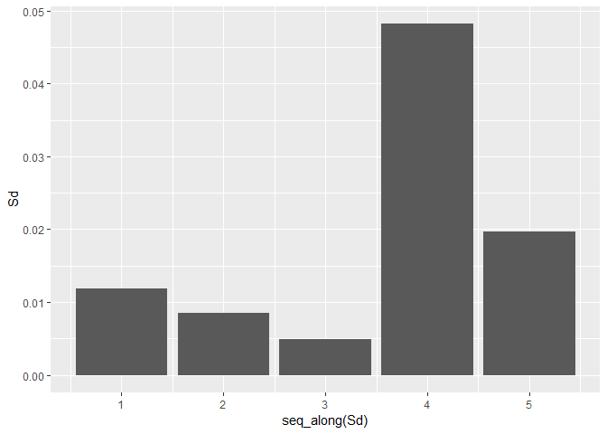
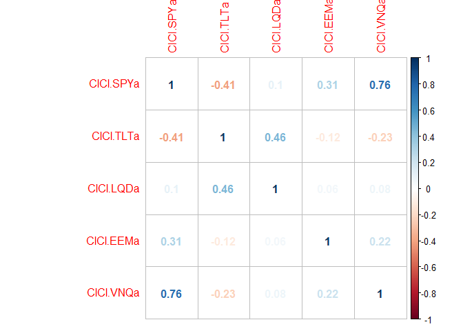

Excercise 1
================
Apoorva\_Reddy\_Adavalli
8 August 2018

Problem : Problem Exploratory Analysis - Green Buildings
--------------------------------------------------------

``` r
getwd()
```

    ## [1] "D:/UT Austin/Summer Sem/Predictive Modelling - Carlos M Carvalho/Week 2/Excercise"

``` r
setwd("D:/UT Austin/Summer Sem/Predictive Modelling - Carlos M Carvalho/Week 2/Excercise")
library(ggplot2)
df=read.csv('greenbuildings_filtered.csv')
df$green_rating=as.factor(df$green_rating)
df$amenities=as.factor(df$amenities)
nrow(df)
```

    ## [1] 7894

``` r
## creating a column for neighbourhood indicator  
df$Class=ifelse(df$class_b=='1','B',ifelse(df$class_a=='1','A','C'))
## Creating yearly_rent by multiplying rent per sq foot and leasing rate
df$yearly_rent=df$leasing_rate*df$Rent
df$green_rating1=ifelse(df$green_rating==1,'green','not green')
```

``` r
par(mfcol=c(2,1))
ggplot(df,aes(x=Rent))+geom_histogram(bins = 30)
```


``` r
ggplot(df,aes(x=yearly_rent))+geom_histogram(bins = 30)
```


Rent histogram shows that it's distribution is right skewed.

Flaws in the assumptions
========================

There are many flaws in the assumptions made by the Excel guru and I dont complete agree with the conclusions made out of it.


Flaw 1:
=======

While cleaning the data, low occupancy rates are removed which is not necessary because it is neither relevant to the price nor the green\_rating.According to the above plot, buildings with low occupancy rates do not have unusually high prices. So, it is not clear as to why these rows must be removed or to be considered as outliers. Both high and low lease rates show low rents and the outliers of the rent have higher leasing rate. So removing only less than 10% leasing rate buildings doesnt make sense wrt Rent.

``` r
df$class_rating=paste(df$Class,df$green_rating1)
C_R=aggregate(Rent~ class_rating, data = df, FUN = function(x) c(mean = mean(x), median= median(x),count = length(x)  ) )
agg_C_R <- do.call(data.frame, C_R)
C_R1=aggregate(Rent~ green_rating1, data = df, FUN = function(x) c(mean = mean(x), median= median(x),count = length(x)  ) )
agg_C_R1 <- do.call(data.frame, C_R1)
agg_C_R1
```

    ##   green_rating1 Rent.mean Rent.median Rent.count
    ## 1         green  30.01603        27.6        685
    ## 2     not green  28.26678        25.0       7209

``` r
qplot(class_rating, Rent, data=df, geom=c("boxplot"), 
      fill=Class, main="Avg rent per class",
      xlab="", ylab="Rent")
```


Flaw 2:
=======

Excel guru has removed the outliers on the basis of occupancy rate and assumed that this made rent fall within a particular range. And then considers median after noticing more outliers in rent value. Considering median instead of mean is correct but for other reasons. The above box plot and agg\_C\_R table shows that there are outliers within 'Rent' values and the significant difference between median and mean.

``` r
ggplot(agg_C_R, aes(class_rating, Rent.mean,fill=class_rating,alpha=0.5)) +
  geom_col()+ geom_bar(aes(y=Rent.median),stat="identity",col="black",lwd=0.7)+ggtitle("Median and Mean comparision among Class-Green Rating buildings")
```


Flaw 3:
=======

The excel guru did not consider the class of neighbourhood into account and took the overall median value. From the above graph, it is clear that if East Cesar Chavez is of class A then the difference in median prices between with green\_rating and without green rating is less significant.But it would be much more if the building belongs to class C.

``` r
df_green=df[df$green_rating==1,]
C_R_4=aggregate(Rent~ Class, data = df_green, FUN = length)
C_R_4$'%total'=round(C_R_4$Rent/length(df_green$Rent)*100,0)
C_R_4
```

    ##   Class Rent %total
    ## 1     A  546     80
    ## 2     B  132     19
    ## 3     C    7      1

``` r
library(reshape2)
library(reshape)
```

    ## 
    ## Attaching package: 'reshape'

    ## The following objects are masked from 'package:reshape2':
    ## 
    ##     colsplit, melt, recast

``` r
q1=cast(df,cluster~green_rating,value='Rent',median)
q1$greenrentwrtnongreen=ifelse(round(q1$`1`,1)>round(q1$`0`,1),'Greater','Lesser')
q1$difference_per_cluster=q1$`1`-q1$`0`
q2=cast(q1,greenrentwrtnongreen~.,value='difference_per_cluster',length)
qplot(cluster,difference_per_cluster,data=q1,col=greenrentwrtnongreen)
```

    ## Warning: Removed 10 rows containing missing values (geom_point).


``` r
ggplot(q2,aes(greenrentwrtnongreen,`(all)`,fill=greenrentwrtnongreen)) + 
  geom_bar(stat="identity",position="dodge")+labs(x = "Green building rent wrt Non-green building rent")+labs(y="# Clusters")+
  labs(title = "# Comparision of median rent of green and non-green buildings among clusters")+geom_text(aes(label = `(all)`))
```


Flaw 4:
=======

There are 209 clusters where the median rent of non-green building is higher than green buildings. So if the above chosen East Cesar Chavez falls into one of these 209 clusters then investing in green building wouldn't be very profitable.

``` r
df$empl_gr=df$empl_gr.int
q5=cast(df_green,Class~.,value='Rent',length)
q5$Fraction=round(q5$`(all)`/length(df_green$Building.ID)*100,2)
ggplot(q5,aes(Class,`(all)`,fill=Class)) + 
  geom_bar(stat="identity",position="dodge")+labs(x = "Class")+labs(y="# Green buildings")+
  labs(title = "# Green_buildings by Clusters")+geom_text(aes(label = `(all)`))+geom_text(aes(label = paste(Fraction,"%"),hjust=0.5, vjust=2, size=0.5))
```


Flaw 5:
=======

According to excel guru, the green\_ratings buildings have higher price on a whole by 2$ per sq.foot and is the sole factor. Out of all the green\_buildings 80% of them belong to Class A abd 19% belong to Class B and only 1% belogn to Class C. So this Class A is increasing the average of the green buildings. Similarly large size, more amenities also increse the rent and hence are important while calculating the premium on rent.

Flaw 6:
=======

Repurcating the costs within 7.7 years has an underlying assumption of 90% occupany rate in all the future years. Occupancy rate is fraction of space under current lease. Unless we have the data for future and the occupancy fraction we cant comment on the repurcation costs There are also other factors like depreciation, maitainence costs, renovation costs, rental value adjustments in the next 30 years. So cannot estimate the profits.

Lets run a regression to understand the effect of each variable on Rent and understand the relationship
=======================================================================================================

``` r
df_lm=df[,1:22]
df3=cbind(df[,2:7],lapply(df[colnames(df[,8:15])], factor),df[,16:22])
df3$cluster=as.factor(df3$cluster)
df4=df3
df4$cluster=NULL
df_lm=lm(Rent~.,df4)
summary(df_lm)
```

    ## 
    ## Call:
    ## lm(formula = Rent ~ ., data = df4)
    ## 
    ## Residuals:
    ##     Min      1Q  Median      3Q     Max 
    ## -53.727  -3.615  -0.506   2.442 174.922 
    ## 
    ## Coefficients: (1 not defined because of singularities)
    ##                     Estimate Std. Error t value Pr(>|t|)    
    ## (Intercept)       -6.627e+00  9.421e-01  -7.034 2.18e-12 ***
    ## size               6.711e-06  6.532e-07  10.274  < 2e-16 ***
    ## leasing_rate       8.233e-03  5.288e-03   1.557 0.119554    
    ## stories           -3.422e-02  1.607e-02  -2.129 0.033246 *  
    ## age               -1.086e-02  4.642e-03  -2.339 0.019352 *  
    ## renovated1        -2.221e-01  2.547e-01  -0.872 0.383053    
    ## class_a1           2.925e+00  4.339e-01   6.742 1.67e-11 ***
    ## class_b1           1.158e+00  3.410e-01   3.397 0.000686 ***
    ## LEED1              1.877e+00  3.580e+00   0.524 0.600043    
    ## Energystar1       -1.799e-01  3.815e+00  -0.047 0.962391    
    ## green_rating1      6.469e-01  3.836e+00   0.169 0.866071    
    ## net1              -2.547e+00  5.915e-01  -4.306 1.68e-05 ***
    ## amenities1         5.352e-01  2.485e-01   2.154 0.031258 *  
    ## cd_total_07        7.002e-05  1.328e-04   0.527 0.597956    
    ## hd_total07         4.795e-04  8.645e-05   5.546 3.02e-08 ***
    ## total_dd_07               NA         NA      NA       NA    
    ## Precipitation      1.117e-02  1.389e-02   0.804 0.421258    
    ## Gas_Costs         -2.763e+02  7.415e+01  -3.727 0.000195 ***
    ## Electricity_Costs  1.502e+02  2.207e+01   6.805 1.09e-11 ***
    ## cluster_rent       1.029e+00  1.298e-02  79.298  < 2e-16 ***
    ## ---
    ## Signif. codes:  0 '***' 0.001 '**' 0.01 '*' 0.05 '.' 0.1 ' ' 1
    ## 
    ## Residual standard error: 9.408 on 7875 degrees of freedom
    ## Multiple R-squared:  0.6114, Adjusted R-squared:  0.6105 
    ## F-statistic: 688.4 on 18 and 7875 DF,  p-value: < 2.2e-16

Size, stories, age, class, net, amenities, hd\_total, cluster\_rent, costs have a significant relationship with rent. Note that linear regression shows that energy star rating is not a significant varibale when all the given variables are considered.

``` r
df_lm1=lm(Rent~green_rating+class_a+class_b,df3)
df_lm_summary=summary(df_lm1)
df_lm_summary$sigma
```

    ## [1] 14.71219

``` r
df_lm2=lm(Rent~green_rating+class_a+class_b+as.factor(cluster),df3)
df_lm_2_summary=summary(df_lm2)
df_lm_2_summary$sigma
```

    ## [1] 9.689415

Conclusion:
===========

We'll notice that RSE is decreasing as we are adding the variables . So certainly more number of variables are needed to take the decision in this case and more information in terms of location, cluster is needed in order to make an informed decision.

############################################################################################################# 

Problem : Bootstrapping\_Portfolio\_Investment
----------------------------------------------

``` r
options("getSymbols.warning4.0"=FALSE)
library(mosaic)
```

    ## Loading required package: dplyr

    ## 
    ## Attaching package: 'dplyr'

    ## The following object is masked from 'package:reshape':
    ## 
    ##     rename

    ## The following objects are masked from 'package:stats':
    ## 
    ##     filter, lag

    ## The following objects are masked from 'package:base':
    ## 
    ##     intersect, setdiff, setequal, union

    ## Loading required package: lattice

    ## Loading required package: ggformula

    ## Loading required package: ggstance

    ## 
    ## Attaching package: 'ggstance'

    ## The following objects are masked from 'package:ggplot2':
    ## 
    ##     geom_errorbarh, GeomErrorbarh

    ## 
    ## New to ggformula?  Try the tutorials: 
    ##  learnr::run_tutorial("introduction", package = "ggformula")
    ##  learnr::run_tutorial("refining", package = "ggformula")

    ## Loading required package: mosaicData

    ## Loading required package: Matrix

    ## 
    ## Attaching package: 'Matrix'

    ## The following object is masked from 'package:reshape':
    ## 
    ##     expand

    ## 
    ## The 'mosaic' package masks several functions from core packages in order to add 
    ## additional features.  The original behavior of these functions should not be affected by this.
    ## 
    ## Note: If you use the Matrix package, be sure to load it BEFORE loading mosaic.

    ## 
    ## Attaching package: 'mosaic'

    ## The following object is masked from 'package:Matrix':
    ## 
    ##     mean

    ## The following objects are masked from 'package:dplyr':
    ## 
    ##     count, do, tally

    ## The following object is masked from 'package:ggplot2':
    ## 
    ##     stat

    ## The following objects are masked from 'package:stats':
    ## 
    ##     binom.test, cor, cor.test, cov, fivenum, IQR, median,
    ##     prop.test, quantile, sd, t.test, var

    ## The following objects are masked from 'package:base':
    ## 
    ##     max, mean, min, prod, range, sample, sum

``` r
library(quantmod)
```

    ## Loading required package: xts

    ## Loading required package: zoo

    ## 
    ## Attaching package: 'zoo'

    ## The following objects are masked from 'package:base':
    ## 
    ##     as.Date, as.Date.numeric

    ## 
    ## Attaching package: 'xts'

    ## The following objects are masked from 'package:dplyr':
    ## 
    ##     first, last

    ## Loading required package: TTR

    ## Version 0.4-0 included new data defaults. See ?getSymbols.

``` r
library(foreach)
my_favorite_seed = 1234567
set.seed(my_favorite_seed)
mystocks = c("SPY", "TLT", "LQD","EEM","VNQ")
getSymbols(mystocks,from="2001-01-01")
```

    ## 
    ## WARNING: There have been significant changes to Yahoo Finance data.
    ## Please see the Warning section of '?getSymbols.yahoo' for details.
    ## 
    ## This message is shown once per session and may be disabled by setting
    ## options("getSymbols.yahoo.warning"=FALSE).

    ## [1] "SPY" "TLT" "LQD" "EEM" "VNQ"

``` r
SPYa = adjustOHLC(SPY)
TLTa = adjustOHLC(TLT)
LQDa = adjustOHLC(LQD)
EEMa = adjustOHLC(EEM)
VNQa = adjustOHLC(VNQ)
```

``` r
plot(ClCl(SPYa))
```


``` r
plot(ClCl(TLTa))
```


``` r
plot(ClCl(LQDa)) 
```


``` r
plot(ClCl(EEMa))
```


``` r
plot(ClCl(VNQa))
```


All the stocks have suffered during 2008 financial depression. In general Bonds(TLT and LQD) are always considered to be safe investments. Let us also look at the standard deviation of returns of all these stocks. Lower the standard deviation lower is the risk

``` r
all_returns = cbind(ClCl(SPYa),ClCl(TLTa),ClCl(LQDa),ClCl(EEMa),ClCl(VNQa))
Sd=round(sapply(all_returns, sd, na.rm = TRUE),4)
ggplot(data.frame(Sd),aes(x=seq_along(Sd),Sd))+geom_bar(stat="identity")
```



It is evident that LQD and TLT have the least standard deviations followed by SPY So we will be choosing Bonds (TLT and LQD) and US Domestic equities(SPY) to create a safe portfolio. And, for an aggressive portfolio let us consider Real estate(VNQ) and Emerging-market equities (EEM) because they are usually more volatile i.e. high standard deviation in returns.

``` r
all_returns = as.matrix(na.omit(all_returns))
boxplot(all_returns)
```


``` r
pairs(all_returns)
```


``` r
library(corrplot)
```

    ## corrplot 0.84 loaded

``` r
corrplot(cor(all_returns),method=c('number'))
```



We can see correlation among all the stocks' returns. Particularly VNQ has strong relationshp with SPY

Bootstrapping for Even Portfolio 1 (P1)
=======================================

``` r
initial_wealth = 100000
P1_my_weights = c(0.2,0.2,0.2, 0.2, 0.2)
simulation_P1 = foreach(i=1:1000, .combine='rbind') %do% {
  total_wealth = initial_wealth
  weights_P1 = P1_my_weights
  holdings_P1 = weights_P1 * total_wealth
  n_days = 20 #4 week trading 
  wealthtracker_P1 = rep(0, n_days)
  for(today in 1:n_days) {
    return.today_P1 = resample(all_returns, 1, orig.ids=FALSE)
    holdings_P1 = holdings_P1 + holdings_P1*return.today_P1
    total_wealth_P1 = sum(holdings_P1)
    wealthtracker_P1[today] = total_wealth_P1
  }
  wealthtracker_P1
}

head(simulation_P1)
```

    ##               [,1]     [,2]      [,3]      [,4]      [,5]      [,6]
    ## result.1 100268.86 100336.3  99911.56 100454.03 101075.92 101712.49
    ## result.2 100298.16 100068.2  97690.65  97638.73  95268.52  94774.45
    ## result.3  99712.17 100180.5  99487.31 100070.11 100430.45  99075.00
    ## result.4 136414.55 136667.0 136883.04 137181.16 137235.04 135739.97
    ## result.5 100659.92 100534.5 100248.09  99400.77  99889.05  98554.35
    ## result.6 100708.78 100437.1 100387.08 100121.98  92534.14  92660.76
    ##               [,7]      [,8]      [,9]     [,10]     [,11]     [,12]
    ## result.1 101150.36  99055.04  98813.19  97301.10  97592.91 101493.85
    ## result.2  95100.05  95449.81  96155.71  96740.74  97192.24  97605.49
    ## result.3  98410.22  98736.90  99176.32 100403.70 100131.90 100304.13
    ## result.4 136317.63 135661.89 134929.58 134701.01 132059.84 135805.10
    ## result.5  99831.67  98387.19  99107.31  99351.49  99229.23  99656.34
    ## result.6  91697.99  91407.82  89410.23  89597.58  90585.41  90173.39
    ##              [,13]     [,14]     [,15]     [,16]     [,17]     [,18]
    ## result.1 101195.76 101474.02 101185.67 101338.05 101101.58  96004.88
    ## result.2  96683.29  97105.62  99674.66  99345.01  99067.28 101294.35
    ## result.3 101158.77 101104.26 101033.98  98397.49  98032.54  97714.27
    ## result.4 135874.42 135006.24 135280.63 134850.47 134879.14 135763.84
    ## result.5  99390.98  98244.63  99768.71 100309.04 100136.67 100009.75
    ## result.6  88972.85  88845.21  89019.38  89451.74  89284.09  89224.71
    ##              [,19]     [,20]
    ## result.1  96366.43  96246.15
    ## result.2 101654.12 101356.40
    ## result.3  98456.98  97956.35
    ## result.4 135367.97 134219.57
    ## result.5  98297.25  98308.65
    ## result.6  90547.00  90414.50

``` r
hist(simulation_P1[,n_days],40)
```


``` r
mean(simulation_P1[,n_days])
```

    ## [1] 101390.9

``` r
hist(simulation_P1[,n_days]- initial_wealth, breaks=40)
```


``` r
#Calculate 5% value at risk
c1=quantile(simulation_P1[,n_days], 0.05) - initial_wealth
Value_at_risk = c("Even Portfolio",quantile(simulation_P1[,n_days], 0.05) - initial_wealth)
print (paste0("He will loose " ,abs(round(c1,0)),"USD with probability of 5% in case of even protfolio"))
```

    ## [1] "He will loose 5905USD with probability of 5% in case of even protfolio"

Bootstrapping for Safe Portfolio (P2)
=====================================

``` r
simulation_P2 = foreach(i=1:1000, .combine='rbind') %do% {
  total_wealth = initial_wealth
  weights_P2 = c(0.2,0.3,0.5)
  holdings_P2 = weights_P2 * total_wealth
  n_days = 20 #4 week trading 
  wealthtracker_P2 = rep(0, n_days)
  
  for(today in 1:n_days) {
    return.today_P2 = resample(all_returns[,1:3], 1, orig.ids=FALSE)
    holdings_P2 = holdings_P2 + holdings_P2*return.today_P2
    total_wealth_P2 = sum(holdings_P2)
    wealthtracker_P2[today] = total_wealth_P2
  }
  wealthtracker_P2
}

head(simulation_P2)
```

    ##               [,1]      [,2]      [,3]      [,4]      [,5]      [,6]
    ## result.1 100511.32  99978.96  99980.24 100422.49 101245.98 101303.84
    ## result.2 100235.86 100745.46 101161.20 100824.64 100634.20 101216.65
    ## result.3 100529.36 100020.95 100478.92 100300.46 100420.14 100708.19
    ## result.4 100185.64 100353.87 100283.86 100285.77 101289.70 101548.44
    ## result.5  99855.82 100164.99 100083.46  99792.75  99924.36 100055.52
    ## result.6  99352.82  99607.52  99691.95  99329.91  99115.22  98934.65
    ##               [,7]      [,8]      [,9]     [,10]     [,11]     [,12]
    ## result.1 101458.37 101370.52 102036.80 101441.67 100822.05 100581.67
    ## result.2 101221.27 100973.88 100559.94 100576.79 100865.45 100462.75
    ## result.3 101574.16 101546.03 102786.37 102943.68 101942.25 102189.32
    ## result.4 101093.13 101430.89 101079.54 100603.12 100966.14 100747.64
    ## result.5  99830.70 100129.42 100488.12 100637.74 100850.14 101646.93
    ## result.6  98827.14  98699.16  98849.48  98769.98  98930.52  98860.44
    ##             [,13]    [,14]     [,15]     [,16]     [,17]     [,18]
    ## result.1 101298.1 101456.8 101293.57 101056.14 100976.20 100574.36
    ## result.2 100582.4 100768.6  99783.88  99736.01  99759.87  99741.68
    ## result.3 102059.2 101829.0 101845.54 101491.97 101580.43 102552.89
    ## result.4 100532.0 100703.3 101013.44 100894.45 100852.32 100573.34
    ## result.5 101492.2 101119.4 100936.35 101493.63 101415.12 100859.31
    ## result.6 100180.8 100326.5  99559.26  98221.91  98459.68  97577.11
    ##              [,19]     [,20]
    ## result.1 100989.84 101001.15
    ## result.2  99569.01  99965.05
    ## result.3 102627.86 102332.52
    ## result.4  99961.16  99799.92
    ## result.5 101179.32 100750.87
    ## result.6  97369.71  96379.14

``` r
hist(simulation_P2[,n_days],40)
```


``` r
mean(simulation_P2[,n_days])
```

    ## [1] 100670.9

``` r
hist(simulation_P2[,n_days]- initial_wealth, breaks=40)
```


``` r
# Calculate 5% value at risk
c2=quantile(simulation_P2[,n_days], 0.05) - initial_wealth
Value_at_risk = rbind(Value_at_risk,c("Safe Portfolio",quantile(simulation_P2[,n_days], 0.05) - initial_wealth))
print (paste0("He will loose " ,abs(round(c2,0)),"USD with probability of 5%" ))
```

    ## [1] "He will loose 2537USD with probability of 5%"

Bootstrapping for Aggressive Portfolio (P3)
===========================================

``` r
simulation_P3 = foreach(i=1:1000, .combine='rbind') %do% {
  total_wealth = initial_wealth
  weights_P3 = c(0.5,0.5)
  holdings_P3 = weights_P3 * total_wealth
  n_days = 20 #4 week trading 
  wealthtracker_P3 = rep(0, n_days)
  
  for(today in 1:n_days) {
    return.today_P3 = resample(all_returns[,4:5], 1, orig.ids=FALSE)
    holdings_P3 = holdings_P3 + holdings_P3*return.today_P3
    total_wealth_P3 = sum(holdings_P3)
    wealthtracker_P3[today] = total_wealth_P3
  }
  wealthtracker_P3
}

head(simulation_P3)
```

    ##               [,1]     [,2]     [,3]      [,4]      [,5]      [,6]
    ## result.1 100540.07 101041.0 102182.1 101479.59  99707.81  98784.20
    ## result.2  99203.94 101791.8 100222.1  95171.66  94365.40  93835.21
    ## result.3  99050.41 102368.3 100601.4 101476.80  99285.76  99338.15
    ## result.4 101577.75 101474.9 100771.9 100823.85 104049.19 102217.69
    ## result.5 100579.58 102235.3 100253.0 100923.41  98517.34  97832.77
    ## result.6 100443.56 106804.1 106530.3 107424.80 107475.53 107964.90
    ##               [,7]      [,8]      [,9]     [,10]     [,11]     [,12]
    ## result.1  97682.93  98389.51  98636.96  98450.76  98379.88  97670.29
    ## result.2  92953.20  92934.76  92423.78  94879.41  95443.46  96691.15
    ## result.3  99250.57  99519.57  99580.22  98306.45  98421.51  99971.50
    ## result.4 102183.89 102112.83  99862.65  97236.34  98393.38  99022.20
    ## result.5  98401.71  98659.72 100184.11 100585.42 101229.32 101108.04
    ## result.6 107963.16 106860.41 108886.77 109579.82 107470.63 105300.26
    ##              [,13]     [,14]     [,15]     [,16]     [,17]     [,18]
    ## result.1  98091.21  98964.80  98173.65  98665.47  99040.32  98755.10
    ## result.2  95055.95  95443.14  96958.67  97382.63  94576.59  99128.94
    ## result.3 103738.19 103612.09 103406.18 101883.97 101961.65 101724.56
    ## result.4  98280.77  98634.89  98265.68  96670.38  86573.63  86760.00
    ## result.5 102337.32 103242.64 103861.05 101829.98  97337.63  96990.70
    ## result.6 104251.27 103856.50 101338.35 100083.27  99862.03 100741.64
    ##              [,19]     [,20]
    ## result.1  98577.01 100056.82
    ## result.2  98002.06 101200.34
    ## result.3 102288.27 102739.16
    ## result.4  84853.03  84822.17
    ## result.5  96761.56  96720.48
    ## result.6 100434.73 101070.45

``` r
hist(simulation_P3[,n_days],40)
```


``` r
mean(simulation_P3[,n_days])
```

    ## [1] 102613.4

``` r
hist(simulation_P3[,n_days]- initial_wealth, breaks=40)
```


``` r
# Calculate 5% value at risk
c3=quantile(simulation_P3[,n_days], 0.05) - initial_wealth
Value_at_risk = rbind(Value_at_risk,c("Aggressive Portfolio",quantile(simulation_P3[,n_days], 0.05) - initial_wealth))
print (paste0("He will loose " ,abs(round(c3,0)),"USD with probability of 5% in case of aggressive protfolio"))
```

    ## [1] "He will loose 12008USD with probability of 5% in case of aggressive protfolio"

``` r
Value_at_risk
```

    ##                                      5%                 
    ## Value_at_risk "Even Portfolio"       "-5904.50237634609"
    ##               "Safe Portfolio"       "-2536.70521878128"
    ##               "Aggressive Portfolio" "-12007.6491495015"

It is clear that portfolio with a split of 20% in SPY, 30% in TLT and 50% LQD would be the safest option because it results in least losses at 5% probability compared to 2 other portfolios considered.

############################################################################################################# 

Problem : Social\_Marketing
---------------------------

``` r
library(LICORS)
social_marketing=read.csv('social_marketing.csv')
```

``` r
# Cleaning data and removing irrelevant variables 
social_marketing=social_marketing[,-1]
social_marketing$spam=NULL
social_marketing$chatter=NULL
social_marketing$uncategorized=NULL
head(social_marketing)
```

    ##   current_events travel photo_sharing tv_film sports_fandom politics food
    ## 1              0      2             2       1             1        0    4
    ## 2              3      2             1       1             4        1    2
    ## 3              3      4             3       5             0        2    1
    ## 4              5      2             2       1             0        1    0
    ## 5              2      0             6       0             0        2    0
    ## 6              4      2             7       1             1        0    2
    ##   family home_and_garden music news online_gaming shopping
    ## 1      1               2     0    0             0        1
    ## 2      2               1     0    0             0        0
    ## 3      1               1     1    1             0        2
    ## 4      1               0     0    0             0        0
    ## 5      1               0     0    0             3        2
    ## 6      1               1     1    0             0        5
    ##   health_nutrition college_uni sports_playing cooking eco computers
    ## 1               17           0              2       5   1         1
    ## 2                0           0              1       0   0         0
    ## 3                0           0              0       2   1         0
    ## 4                0           1              0       0   0         0
    ## 5                0           4              0       1   0         1
    ## 6                0           0              0       0   0         1
    ##   business outdoors crafts automotive art religion beauty parenting dating
    ## 1        0        2      1          0   0        1      0         1      1
    ## 2        1        0      2          0   0        0      0         0      1
    ## 3        0        0      2          0   8        0      1         0      1
    ## 4        1        0      3          0   2        0      1         0      0
    ## 5        0        1      0          0   0        0      0         0      0
    ## 6        1        0      0          1   0        0      0         0      0
    ##   school personal_fitness fashion small_business adult
    ## 1      0               11       0              0     0
    ## 2      4                0       0              0     0
    ## 3      0                0       1              0     0
    ## 4      0                0       0              0     0
    ## 5      0                0       0              1     0
    ## 6      0                0       0              0     0

``` r
social_marketing1 <- scale(social_marketing, center=TRUE, scale=TRUE) 
my_favorite_seed = 1234567
```

Correlation
===========

``` r
library(corrplot)
Correlation_matrix_social=cor(social_marketing1)
corrplot(Correlation_matrix_social,method='circle',type='lower')
```


``` r
##Setting the threshold and looking at only highly correlated attributes
Correlation_matrix_social[abs(Correlation_matrix_social) < 0.6] <- NA
corrplot(Correlation_matrix_social,method='circle',type='lower')
```


Insights 1)High correlation between online\_gaming and univ\_colleges representing young population. 2)Outdoor, fitness, personal\_nutrition strongly related. Makes sense. 3)Cooking, beauty, fashion strongly correlated representing female poupulation.

Clustering
==========

``` r
set.seed(my_favorite_seed)
clusters <- kmeans(social_marketing1, centers = 5, nstart = 100)
hist(clusters$cluster)
```


``` r
clusters$size
```

    ## [1]  712  933 4839  611  787

``` r
clusters$centers
```

    ##   current_events      travel photo_sharing     tv_film sports_fandom
    ## 1     0.09663091  1.73998801  -0.064327076  0.08801958     0.1859279
    ## 2     0.01773600 -0.15044490   0.004279626 -0.02944960    -0.2044569
    ## 3    -0.06116837 -0.20641049  -0.142361774 -0.01807900    -0.2841650
    ## 4     0.19148099 -0.03826632   1.229674805  0.05629391    -0.2052086
    ## 5     0.11899611 -0.09695717  -0.026219431  0.02273857     1.9807300
    ##     politics       food      family home_and_garden       music
    ## 1  2.3276822  0.0260945  0.05199343       0.1244477 -0.04586997
    ## 2 -0.1809720  0.4039272 -0.06339472       0.1661575  0.07413271
    ## 3 -0.2579974 -0.3473547 -0.23360285      -0.1008656 -0.09489584
    ## 4 -0.1316701 -0.1759344  0.04360903       0.1552136  0.58309829
    ## 5 -0.2027484  1.7698879  1.43060611       0.1901162  0.08439834
    ##          news online_gaming     shopping health_nutrition  college_uni
    ## 1  1.91185092  -0.008720854 -0.009496204      -0.20144483  0.044973596
    ## 2 -0.05089773  -0.016287207  0.046051811       2.06888331 -0.085335121
    ## 3 -0.24942439  -0.011498168 -0.062624505      -0.33446415 -0.008626153
    ## 4 -0.07757994   0.088551210  0.375582901      -0.07483581  0.148160407
    ## 5 -0.07545654   0.029148738  0.047463514      -0.15583573 -0.001509006
    ##   sports_playing    cooking         eco   computers    business
    ## 1     0.06897143 -0.2132310  0.10991407  1.54072936  0.36239470
    ## 2     0.05015292  0.3670649  0.51245050 -0.08504485  0.06519368
    ## 3    -0.08367324 -0.3367019 -0.15465715 -0.23283356 -0.12000640
    ## 4     0.28431327  2.5023146  0.07650557  0.07689752  0.28460103
    ## 5     0.17189207 -0.1146945  0.18458182  0.07883704  0.11177765
    ##      outdoors     crafts  automotive         art    religion     beauty
    ## 1  0.11698216  0.1645619  1.09194646  0.01890182 -0.04249063 -0.1788191
    ## 2  1.58072871  0.1045816 -0.11710523  0.01956508 -0.17744674 -0.2138177
    ## 3 -0.31598082 -0.1746242 -0.17119236 -0.04240493 -0.29589005 -0.2736231
    ## 4  0.03083788  0.1518957  0.05505111  0.14878152 -0.12846057  2.3308757
    ## 5 -0.06089195  0.6829165  0.16080928  0.10492967  2.16786846  0.2880661
    ##      parenting      dating      school personal_fitness     fashion
    ## 1  0.004639843  0.19610832 -0.04444393      -0.19093965 -0.17249648
    ## 2 -0.112184671  0.17485252 -0.15087122       2.03418187 -0.11184888
    ## 3 -0.300479643 -0.08636194 -0.24989509      -0.34005866 -0.26000284
    ## 4 -0.090657781  0.13559461  0.17070480      -0.04989235  2.41513574
    ## 5  2.046731416  0.04102997  1.62306051      -0.10916718  0.01229769
    ##   small_business        adult
    ## 1     0.22386776 -0.074480822
    ## 2    -0.06554433  0.003959199
    ## 3    -0.07773760  0.009608355
    ## 4     0.30050947 -0.008511682
    ## 5     0.11984751  0.010218833

``` r
set.seed(my_favorite_seed)
clusters <- kmeans(social_marketing1, centers = 5, nstart = 100)
hist(clusters$cluster)
```


``` r
clusters$size
```

    ## [1]  712  933 4839  611  787

``` r
clusters$centers
```

    ##   current_events      travel photo_sharing     tv_film sports_fandom
    ## 1     0.09663091  1.73998801  -0.064327076  0.08801958     0.1859279
    ## 2     0.01773600 -0.15044490   0.004279626 -0.02944960    -0.2044569
    ## 3    -0.06116837 -0.20641049  -0.142361774 -0.01807900    -0.2841650
    ## 4     0.19148099 -0.03826632   1.229674805  0.05629391    -0.2052086
    ## 5     0.11899611 -0.09695717  -0.026219431  0.02273857     1.9807300
    ##     politics       food      family home_and_garden       music
    ## 1  2.3276822  0.0260945  0.05199343       0.1244477 -0.04586997
    ## 2 -0.1809720  0.4039272 -0.06339472       0.1661575  0.07413271
    ## 3 -0.2579974 -0.3473547 -0.23360285      -0.1008656 -0.09489584
    ## 4 -0.1316701 -0.1759344  0.04360903       0.1552136  0.58309829
    ## 5 -0.2027484  1.7698879  1.43060611       0.1901162  0.08439834
    ##          news online_gaming     shopping health_nutrition  college_uni
    ## 1  1.91185092  -0.008720854 -0.009496204      -0.20144483  0.044973596
    ## 2 -0.05089773  -0.016287207  0.046051811       2.06888331 -0.085335121
    ## 3 -0.24942439  -0.011498168 -0.062624505      -0.33446415 -0.008626153
    ## 4 -0.07757994   0.088551210  0.375582901      -0.07483581  0.148160407
    ## 5 -0.07545654   0.029148738  0.047463514      -0.15583573 -0.001509006
    ##   sports_playing    cooking         eco   computers    business
    ## 1     0.06897143 -0.2132310  0.10991407  1.54072936  0.36239470
    ## 2     0.05015292  0.3670649  0.51245050 -0.08504485  0.06519368
    ## 3    -0.08367324 -0.3367019 -0.15465715 -0.23283356 -0.12000640
    ## 4     0.28431327  2.5023146  0.07650557  0.07689752  0.28460103
    ## 5     0.17189207 -0.1146945  0.18458182  0.07883704  0.11177765
    ##      outdoors     crafts  automotive         art    religion     beauty
    ## 1  0.11698216  0.1645619  1.09194646  0.01890182 -0.04249063 -0.1788191
    ## 2  1.58072871  0.1045816 -0.11710523  0.01956508 -0.17744674 -0.2138177
    ## 3 -0.31598082 -0.1746242 -0.17119236 -0.04240493 -0.29589005 -0.2736231
    ## 4  0.03083788  0.1518957  0.05505111  0.14878152 -0.12846057  2.3308757
    ## 5 -0.06089195  0.6829165  0.16080928  0.10492967  2.16786846  0.2880661
    ##      parenting      dating      school personal_fitness     fashion
    ## 1  0.004639843  0.19610832 -0.04444393      -0.19093965 -0.17249648
    ## 2 -0.112184671  0.17485252 -0.15087122       2.03418187 -0.11184888
    ## 3 -0.300479643 -0.08636194 -0.24989509      -0.34005866 -0.26000284
    ## 4 -0.090657781  0.13559461  0.17070480      -0.04989235  2.41513574
    ## 5  2.046731416  0.04102997  1.62306051      -0.10916718  0.01229769
    ##   small_business        adult
    ## 1     0.22386776 -0.074480822
    ## 2    -0.06554433  0.003959199
    ## 3    -0.07773760  0.009608355
    ## 4     0.30050947 -0.008511682
    ## 5     0.11984751  0.010218833

``` r
# Kmeanspp just gives a better convergence 
clusters = kmeanspp(social_marketing1, k=5, nstart=100)
hist(clusters$cluster)
```


``` r
clusters$size
```

    ## [1]  787 4839  611  712  933

When I chose k=5 then large chunk of data was in a single cluster. This cluster had all the centers in -ve indicating no significant interests except for in adult content. But even that was also almost close to zero. Inorder to split the heavy cluster into further segments I have increased the k from 5 to 9.

``` r
mu = attr(social_marketing1,"scaled:center")
sigma = attr(social_marketing1,"scaled:scale")
clusters_unscaled = clusters$centers * sigma + mu
```

Analyzing each cluster for K=5
==============================

Cluster 1
=========

``` r
library(ggplot2)
print(paste0("Cluster size1: ",length(which(clusters$cluster==1))))
```

    ## [1] "Cluster size1: 787"

``` r
rbind(clusters$centers[1, ], clusters_unscaled[1, ])
```

    ##      current_events      travel photo_sharing    tv_film sports_fandom
    ## [1,]      0.1189961 -0.09695717   -0.02621943 0.02273857      1.980730
    ## [2,]      1.6772554  1.49474415    1.15045033 0.66135973      3.178329
    ##        politics     food   family home_and_garden      music        news
    ## [1,] -0.2027484 1.769888 1.430606       0.1901162 0.08439834 -0.07545654
    ## [2,]  0.4359207 4.232660 6.604492       1.0791854 1.54203178  0.45422574
    ##      online_gaming   shopping health_nutrition  college_uni sports_playing
    ## [1,]    0.02914874 0.04746351       -0.1558357 -0.001509006      0.1718921
    ## [2,]    0.86968709 0.79545664        0.1207272  1.590750835      0.8563206
    ##         cooking       eco  computers  business    outdoors    crafts
    ## [1,] -0.1146945 0.1845818 0.07883704 0.1117776 -0.06089195 0.6829165
    ## [2,]  1.2171922 0.5510434 1.24636675 1.7309180  1.44583346 2.6100453
    ##      automotive       art religion    beauty parenting     dating   school
    ## [1,]  0.1608093 0.1049297 2.167868 0.2880661  2.046731 0.04102997 1.623061
    ## [2,]  1.6409995 2.3581263 2.286677 1.3578631  1.601516 1.13834656 1.716375
    ##      personal_fitness    fashion small_business      adult
    ## [1,]       -0.1091672 0.01229769      0.1198475 0.01021883
    ## [2,]        2.0764105 0.66357839      0.9201166 0.77984118

``` r
qplot(parenting, family, data=social_marketing, color=factor(clusters$cluster),shape = factor(clusters$cluster))
```


1st cluster people love to post about religion,parenting,sports\_fandom, food, family.

Latent factor : We can infer from the interests that this cluster might majorly be middle aged males who are married

Cluster 2
=========

``` r
print(paste0("Cluster size2: ",length(which(clusters$cluster==2))))
```

    ## [1] "Cluster size2: 4839"

``` r
rbind(clusters$centers[2, ], clusters_unscaled[2, ])
```

    ##      current_events     travel photo_sharing   tv_film sports_fandom
    ## [1,]    -0.06116837 -0.2064105    -0.1423618 -0.018079    -0.2841650
    ## [2,]     1.44520170  1.0309943     0.8262380  1.936214     0.2837394
    ##        politics       food     family home_and_garden       music
    ## [1,] -0.2579974 -0.3473547 -0.2336028      -0.1008656 -0.09489584
    ## [2,]  0.5303812  0.1216198  0.6827902       0.4463732  2.14057648
    ##            news online_gaming    shopping health_nutrition  college_uni
    ## [1,] -0.2494244   -0.01149817 -0.06262451       -0.3344641 -0.008626153
    ## [2,]  0.3548894    0.70607890  0.69328441        1.1018640  1.762485479
    ##      sports_playing    cooking        eco  computers   business   outdoors
    ## [1,]    -0.08367324 -0.3367019 -0.1546571 -0.2328336 -0.1200064 -0.3159808
    ## [2,]     1.02975251  0.3107194  0.5956142  0.3959706  0.7771533  1.8336727
    ##          crafts automotive         art  religion     beauty  parenting
    ## [1,] -0.1746242 -0.1711924 -0.04240493 -0.295890 -0.2736231 -0.3004796
    ## [2,]  0.6660944  1.0797076  0.47966639  0.425635  0.2231690 -0.1415741
    ##           dating     school personal_fitness    fashion small_business
    ## [1,] -0.08636194 -0.2498951       -0.3400587 -0.2600028     -0.0777376
    ## [2,]  1.40739065  0.4218736        0.5642774  0.2432223      0.9465530
    ##            adult
    ## [1,] 0.009608355
    ## [2,] 1.485175905

This cluster has almost 50% of the poeple who dont have any particular interests that stands out. All the centers are negative and 'adult' is almost very close to 0.

Cluster 3
=========

``` r
print(paste0("Cluster size3: ",length(which(clusters$cluster==3))))
```

    ## [1] "Cluster size3: 611"

``` r
rbind(clusters$centers[3, ], clusters_unscaled[3, ])
```

    ##      current_events      travel photo_sharing    tv_film sports_fandom
    ## [1,]       0.191481 -0.03826632      1.229675 0.05629391    -0.2052086
    ## [2,]       3.219810  0.82052807      3.613660 0.55563734     0.5495196
    ##        politics        food     family home_and_garden     music
    ## [1,] -0.1316701 -0.17593437 0.04360903       0.1552136 0.5830983
    ## [2,]  0.4761784  0.08427972 1.68824718       0.8391415 3.2388056
    ##             news online_gaming  shopping health_nutrition college_uni
    ## [1,] -0.07757994    0.08855121 0.3755829      -0.07483581   0.1481604
    ## [2,]  0.36952811    1.26496772 2.3654340       1.41396435   1.6605552
    ##      sports_playing   cooking        eco  computers  business   outdoors
    ## [1,]      0.2843133  2.502315 0.07650557 0.07689752 0.2846010 0.03083788
    ## [2,]      1.9729122 10.581015 0.57835231 1.03786707 0.5122612 1.12144010
    ##         crafts automotive       art   religion   beauty   parenting
    ## [1,] 0.1518957 0.05505111 0.1487815 -0.1284606 2.330876 -0.09065778
    ## [2,] 0.6325803 2.81475955 0.8245547  0.5154798 3.537383  1.41122758
    ##         dating    school personal_fitness  fashion small_business
    ## [1,] 0.1355946 0.1707048      -0.04989235 2.415136      0.3005095
    ## [2,] 2.1996350 1.5641448       0.59050705 3.703735      1.1041983
    ##             adult
    ## [1,] -0.008511682
    ## [2,]  0.981011608

Cluster 3 seems to have poeple posting more about Fashion, Beauty, Cooking. Posts about photo sharing is also high in this cluster.

Latent Factor : This cluster could be representing young women.

``` r
qplot(fashion, beauty, data=social_marketing, color=factor(clusters$cluster),shape = factor(clusters$cluster))
```


``` r
qplot(fashion, cooking, data=social_marketing, color=factor(clusters$cluster),shape = factor(clusters$cluster))
```


The above graph shows that more posts on beauty, fashion and cooking are falling into the green cluster which is 3

Cluster 4
=========

``` r
print(paste0("Cluster size4: ",length(which(clusters$cluster==4))))
```

    ## [1] "Cluster size4: 712"

``` r
rbind(clusters$centers[4, ], clusters_unscaled[4, ])
```

    ##      current_events   travel photo_sharing    tv_film sports_fandom
    ## [1,]     0.09663091 1.739988   -0.06432708 0.08801958     0.1859279
    ## [2,]     1.23057647 1.802514    2.27801802 0.75288882     1.0277996
    ##      politics      food     family home_and_garden       music     news
    ## [1,] 2.327682 0.0260945 0.05199343       0.1244477 -0.04586997 1.911851
    ## [2,] 3.533588 1.5593734 1.94623030       1.4669688  0.59443094 3.095020
    ##      online_gaming     shopping health_nutrition college_uni
    ## [1,]  -0.008720854 -0.009496204       -0.2014448   0.0449736
    ## [2,]   0.693570531  0.979211497        2.1465289   0.9148024
    ##      sports_playing    cooking       eco computers  business  outdoors
    ## [1,]     0.06897143 -0.2132310 0.1099141  1.540729 0.3623947 0.1169822
    ## [2,]     1.51412687  0.3481773 0.9800247  3.456974 1.0605007 1.8468005
    ##         crafts automotive        art    religion     beauty   parenting
    ## [1,] 0.1645619   1.091946 0.01890182 -0.04249063 -0.1788191 0.004639843
    ## [2,] 0.8487704   4.713017 0.43633005  1.01404494  1.0319619 1.595608303
    ##         dating      school personal_fitness    fashion small_business
    ## [1,] 0.1961083 -0.04444393       -0.1909396 -0.1724965      0.2238678
    ## [2,] 1.7456895  1.08938874        1.3433121  0.3749556      1.2605797
    ##            adult
    ## [1,] -0.07448082
    ## [2,]  0.29029587

Cluster 4 poeple tweet a lot about ,politics, travel, news, computers.

Latent factor: Tech-savvy guys or business professionals who travel alot

Cluster 5
=========

``` r
print(paste0("Cluster size5: ",length(which(clusters$cluster==5))))
```

    ## [1] "Cluster size5: 933"

``` r
rbind(clusters$centers[5, ], clusters_unscaled[5, ])
```

    ##      current_events     travel photo_sharing    tv_film sports_fandom
    ## [1,]       0.017736 -0.1504449   0.004279626 -0.0294496    -0.2044569
    ## [2,]       1.632338  0.5243088   1.561878566  0.4028525     0.7039072
    ##       politics      food      family home_and_garden      music
    ## [1,] -0.180972 0.4039272 -0.06339472       0.1661575 0.07413271
    ## [2,]  1.026784 2.5081913  1.28492698       1.6553727 2.25249462
    ##             news online_gaming   shopping health_nutrition college_uni
    ## [1,] -0.05089773   -0.01628721 0.04605181         2.068883 -0.08533512
    ## [2,]  0.47428323    0.89665880 0.36480274         4.502116  0.45781439
    ##      sports_playing   cooking       eco   computers   business outdoors
    ## [1,]     0.05015292 0.3670649 0.5124505 -0.08504485 0.06519368 1.580729
    ## [2,]     2.79273655 1.0820098 1.5598929  0.66664323 1.60898601 6.580000
    ##         crafts automotive        art   religion     beauty  parenting
    ## [1,] 0.1045816 -0.1171052 0.01956508 -0.1774467 -0.2138177 -0.1121847
    ## [2,] 1.4252346  0.5249397 0.80633301  0.4695190  0.6056276  2.3903439
    ##         dating     school personal_fitness    fashion small_business
    ## [1,] 0.1748525 -0.1508712         2.034182 -0.1118489    -0.06554433
    ## [2,] 1.0618983  1.1164654         2.078067  0.6770631     0.59403745
    ##            adult
    ## [1,] 0.003959199
    ## [2,] 0.410503751

Cluster 5 people tweet more about personal fitness, health\_nutrition, outdoors.

Latent fator: Health conscious set of poeple fall into this cluster

Using K=5 we were able to seggregate only few types of people Common Traits about interests in music, online\_games, crafts, college\_universities, tv\_film are missing To understand the brand's Twitter followers better , let's split into more clusters. K= 9

K=9
===

``` r
clusters1 = kmeanspp(social_marketing1, k=9, nstart=100)
hist(clusters1$cluster)
```


``` r
clusters1$size
```

    ## [1]  960  685  406  491  439 3375  358  363  805

``` r
clusters_unscaled1 = clusters1$centers * sigma + mu
```

Notice that the highest cluster size dropped to 3375

Cluster 1
=========

``` r
print(paste0("Cluster size1: ",length(which(clusters1$cluster==1))))
```

    ## [1] "Cluster size1: 960"

``` r
rbind(clusters$centers[1, ], clusters_unscaled1[1, ])
```

    ##      current_events      travel photo_sharing    tv_film sports_fandom
    ## [1,]      0.1189961 -0.09695717   -0.02621943 0.02273857     1.9807300
    ## [2,]      1.9979167  0.47055194    1.99217937 0.48759532     0.7318493
    ##        politics      food   family home_and_garden      music        news
    ## [1,] -0.2027484 1.7698879 1.430606       0.1901162 0.08439834 -0.07545654
    ## [2,]  1.1089614 0.2639864 0.905239       1.6614707 0.78311739  0.56531199
    ##      online_gaming   shopping health_nutrition  college_uni sports_playing
    ## [1,]    0.02914874 0.04746351       -0.1558357 -0.001509006      0.1718921
    ## [2,]    1.30962500 2.16288076        0.3125451  0.538153498      0.9257324
    ##         cooking       eco  computers  business    outdoors    crafts
    ## [1,] -0.1146945 0.1845818 0.07883704 0.1117776 -0.06089195 0.6829165
    ## [2,]  0.9612679 0.7957400 0.94956584 2.1178974  0.35993893 1.2779972
    ##      automotive       art  religion    beauty parenting     dating
    ## [1,]  0.1608093 0.1049297 2.1678685 0.2880661 2.0467314 0.04102997
    ## [2,]  1.6030138 0.4575007 0.3439241 0.3418248 0.7436187 1.72509291
    ##         school personal_fitness    fashion small_business      adult
    ## [1,] 1.6230605       -0.1091672 0.01229769      0.1198475 0.01021883
    ## [2,] 0.5531015        0.5716805 1.24604661      0.8892418 1.15679226

Commonality: Religion, parenting, school, food, family, sports\_fandom.

Latent factor : Married middle aged men with children

Cluster 2
=========

``` r
print(paste0("Cluster size2: ",length(which(clusters1$cluster==2))))
```

    ## [1] "Cluster size2: 685"

``` r
rbind(clusters1$centers[2, ], clusters_unscaled1[2, ])
```

    ##      current_events      travel photo_sharing     tv_film sports_fandom
    ## [1,]      0.1098842 -0.09627542   -0.08246158 -0.09693712      2.087584
    ## [2,]      1.8361475  1.00327811    0.36614817  0.65251213      6.105109
    ##        politics     food   family home_and_garden      music       news
    ## [1,] -0.2250206 1.840665 1.514880       0.1631564 0.04351236 -0.1131239
    ## [2,]  1.5555168 3.344491 1.272754       1.0486517 2.14746861  0.5549335
    ##      online_gaming     shopping health_nutrition college_uni
    ## [1,]   -0.07716209 -0.003807084       -0.1446692  -0.1276831
    ## [2,]    1.40864758  1.197533744        0.3230769   0.6159779
    ##      sports_playing     cooking       eco  computers  business    outdoors
    ## [1,]      0.1124811 -0.09524682 0.1859988 0.09083068 0.1182397 -0.07016151
    ## [2,]      1.8370741  2.13899840 1.0839680 0.39248265 0.9977808  1.75757396
    ##         crafts automotive         art religion    beauty parenting
    ## [1,] 0.7017126  0.1234671 -0.01388475 2.291486 0.3264811  2.167474
    ## [2,] 1.6369570  1.8671914  1.17636278 2.009819 1.1556427  6.277743
    ##         dating   school personal_fitness    fashion small_business
    ## [1,] 0.0434601 1.702947       -0.0962100 0.02902002      0.0959068
    ## [2,] 2.7626447 3.156348        0.2768641 0.89673400      2.3271784
    ##          adult
    ## [1,] 0.0279529
    ## [2,] 0.7422697

Commonality: Computers, travel, news, politics.

Latent factor : Tech-savvy/ business professionals who travel or are interested in travelling

Cluster 3
=========

``` r
print(paste0("Cluster size3: ",length(which(clusters1$cluster==3))))
```

    ## [1] "Cluster size3: 406"

``` r
rbind(clusters1$centers[3, ], clusters_unscaled1[3, ])
```

    ##      current_events    travel photo_sharing  tv_film sports_fandom
    ## [1,]       0.303468 0.2246824    -0.0666295 2.781823    -0.1255724
    ## [2,]       3.525703 1.8126564     0.7020821 8.153030     1.4080082
    ##         politics      food     family home_and_garden    music      news
    ## [1,] -0.08953507 0.1368056 -0.1255491       0.3229856 1.000073 0.0194089
    ## [2,]  1.29008291 0.9477511  0.1756497       0.7586207 1.282088 0.9507512
    ##      online_gaming   shopping health_nutrition college_uni sports_playing
    ## [1,]    -0.1702715 0.05843821       -0.1568395   0.3552927      0.1123411
    ## [2,]     2.2316791 1.36588087        0.5929747   2.3166312      2.1291508
    ##         cooking       eco  computers  business    outdoors    crafts
    ## [1,] -0.1416667 0.1120084 -0.1535402 0.3456470 -0.09115927 0.7615523
    ## [2,]  1.1390494 0.9073422  0.1248899 0.7753152  0.44213896 2.0753645
    ##      automotive      art   religion       beauty  parenting      dating
    ## [1,] -0.2126095 2.711161 0.01191717 -0.002395155 -0.1870242 -0.05611856
    ## [2,]  2.1160325 8.494979 0.79708298  1.456304532  1.2217407  1.38689568
    ##           school personal_fitness    fashion small_business       adult
    ## [1,] -0.02836789       -0.1552422 -0.0196801      0.8146374 -0.01867507
    ## [2,]  0.67858842        0.1218034  0.5061819      1.1393532  0.89304033

Commonality: Fashion, Beauty, Cooking, photo sharing.

Latent factor : Young women

Cluster 4
=========

``` r
print(paste0("Cluster size4: ",length(which(clusters1$cluster==4))))
```

    ## [1] "Cluster size4: 491"

``` r
rbind(clusters1$centers[4, ], clusters_unscaled1[4, ])
```

    ##      current_events      travel photo_sharing    tv_film sports_fandom
    ## [1,]      0.1919749 -0.05724216      1.251803 -0.1504192    -0.2070288
    ## [2,]      1.3887314  1.28582593      1.538391  0.7215462     1.0298964
    ##        politics       food     family home_and_garden     music
    ## [1,] -0.1264674 -0.2089549 0.03208357       0.1364225 0.5407528
    ## [2,]  0.5158068  0.6952943 1.56697291       0.8197864 1.2868665
    ##             news online_gaming  shopping health_nutrition college_uni
    ## [1,] -0.07359889   -0.02389888 0.2024676      -0.05232623 -0.01953922
    ## [2,]  0.57968143    1.03064367 1.7556008       0.47311637  0.96084872
    ##      sports_playing  cooking        eco computers  business   outdoors
    ## [1,]      0.2049436 2.787762 0.01179435 0.0644172 0.2094016 0.02813701
    ## [2,]      1.7613771 3.358687 1.11799143 1.6080007 0.8949560 0.68226013
    ##          crafts automotive         art   religion   beauty   parenting
    ## [1,] 0.08655119 0.02614274 0.003893566 -0.1264064 2.616212 -0.06502037
    ## [2,] 0.86512444 1.11365187 1.396411041  0.4126041 5.780089  1.28204056
    ##          dating    school personal_fitness  fashion small_business
    ## [1,] 0.06509604 0.1834994      -0.02783645 2.680792      0.1609800
    ## [2,] 0.70268016 1.4467773       1.49094097 3.440524      0.8389422
    ##            adult
    ## [1,] 0.008948746
    ## [2,] 0.726809957

Commonality: Automotives, news, politics , sports\_fandom.

Latent factor : Young males

Cluster 5
=========

``` r
print(paste0("Cluster size5: ",length(which(clusters1$cluster==5))))
```

    ## [1] "Cluster size5: 439"

``` r
rbind(clusters1$centers[5, ], clusters_unscaled1[5, ])
```

    ##      current_events     travel photo_sharing     tv_film sports_fandom
    ## [1,]     0.06996018 -0.1891834    -0.1967132 -0.02177389     0.6580231
    ## [2,]     1.74518984  1.7166461     0.5611255  0.32287649     1.6091189
    ##      politics       food   family home_and_garden       music     news
    ## [1,] 1.217285 -0.1674179 0.224786        0.158999 -0.08669002 2.625960
    ## [2,] 6.173438  0.4828362 2.098759        1.539554  0.36322048 3.888019
    ##      online_gaming   shopping health_nutrition college_uni sports_playing
    ## [1,]    -0.1294091 -0.1560701       -0.2472476  -0.1951657    -0.09480188
    ## [2,]     1.3143693  1.8655284        0.4920879   0.2156949     0.75649805
    ##        cooking         eco  computers   business  outdoors     crafts
    ## [1,] -0.240559 -0.09145226 -0.1968856 -0.1210827 0.3115248 -0.1713964
    ## [2,]  1.173121  0.58371126  1.1350160  0.9511635 0.6389361  0.5640352
    ##      automotive        art   religion     beauty  parenting       dating
    ## [1,]   2.587268 -0.1736051 -0.1830620 -0.1759352 0.02485086 -0.009032679
    ## [2,]   7.184885  1.7866884  0.5797752  0.2275822 0.89201217  1.967242247
    ##          school personal_fitness    fashion small_business      adult
    ## [1,] 0.01529838       -0.2404074 -0.2136564     -0.1461179 -0.1005650
    ## [2,] 0.72546574        1.0355455  0.7566866      0.3220739  0.6482013

Commonality: Personal\_fitness, outdoors, health\_nutrition.

Latent factor : Health-conscious beings

Cluster 6
=========

``` r
print(paste0("Cluster size5: ",length(which(clusters1$cluster==6))))
```

    ## [1] "Cluster size5: 3375"

``` r
rbind(clusters1$centers[6, ], clusters_unscaled1[6, ])
```

    ##      current_events     travel photo_sharing       tv_film sports_fandom
    ## [1,]     -0.2038843 -0.2191421   -0.42116159 -0.2226027269    -0.3231535
    ## [2,]      1.1706359  0.9145914    0.03850139 -0.0003499731     0.2826157
    ##        politics       food     family home_and_garden      music
    ## [1,] -0.3016258 -0.3642085 -0.3033572      -0.2016203 -0.2311462
    ## [2,]  0.2801377  0.3694332  1.8681543       0.6669829  0.5031019
    ##            news online_gaming   shopping health_nutrition college_uni
    ## [1,] -0.3108079    -0.2321673 -0.3965889       -0.3147020 -0.25920652
    ## [2,]  0.7144967     1.0849070  0.4005006        0.2119853 -0.06672831
    ##      sports_playing    cooking        eco  computers   business   outdoors
    ## [1,]     -0.2567225 -0.3315471 -0.2814029 -0.2571497 -0.2552422 -0.3234952
    ## [2,]      0.3315548  0.2571065  0.4949135  1.9943705  0.5228759  0.3914074
    ##          crafts automotive        art   religion      beauty  parenting
    ## [1,] -0.2938211 -0.3092324 -0.2355086 -0.3040595 -0.27174781 -0.3217469
    ## [2,]  0.7553539  0.8513139  0.8671752  0.2293281 -0.08947105  0.2836519
    ##          dating     school personal_fitness    fashion small_business
    ## [1,] -0.1493084 -0.3141808       -0.3321718 -0.2917631     -0.2191180
    ## [2,]  0.3973801  0.4452433        1.7894468  0.4247270      0.5176499
    ##            adult
    ## [1,] 0.008460572
    ## [2,] 1.482415207

Commonality: Nothing in common (Negative centers).They dont tweet much in general but when they it is about adult stuff

Latent factor : Cant' say

Cluster 7
=========

``` r
print(paste0("Cluster size7: ",length(which(clusters1$cluster==7))))
```

    ## [1] "Cluster size7: 358"

``` r
rbind(clusters1$centers[7, ], clusters_unscaled1[7, ])
```

    ##      current_events   travel photo_sharing     tv_film sports_fandom
    ## [1,]      0.1135864 3.239434    -0.1129446 -0.07099949    -0.2115491
    ## [2,]      1.5991671 3.799301     0.8791376  1.43617180     0.4613705
    ##      politics      food      family home_and_garden       music     news
    ## [1,] 3.087780 0.1521268 -0.09930618       0.0401787 -0.04116224 1.128099
    ## [2,] 4.290966 0.9820029  0.90555929       1.4620453  0.48223565 3.059204
    ##      online_gaming    shopping health_nutrition college_uni sports_playing
    ## [1,]    -0.1566981 -0.06546631       -0.1621952 -0.03732595     0.02913316
    ## [2,]     1.1192614  0.57531438        0.7848311  1.47889983     0.70927681
    ##         cooking       eco computers  business    outdoors    crafts
    ## [1,] -0.1876053 0.1799753  2.916870 0.5385007 -0.03278476 0.2062792
    ## [2,]  0.4278021 1.0316386  5.908742 2.3634329  0.48907876 1.3737378
    ##      automotive        art  religion     beauty  parenting    dating
    ## [1,] -0.1351345 -0.1602435 0.1135568 -0.1797349 0.01319887 0.3408851
    ## [2,]  1.1575489  0.4828576 1.3128492  1.2981984 0.69286425 1.0511319
    ##          school personal_fitness    fashion small_business      adult
    ## [1,] -0.1030475       -0.1456541 -0.1707585      0.3958115 -0.1130456
    ## [2,]  0.5271938        0.8286782  1.0804924      0.8391766  0.7898805

Commonality: schools, parenting, religion, family ,food ,sports\_fandom (almost similar to cluster 1).

Latent factor : Married middle aged men with children

Cluster 8
=========

``` r
print(paste0("Cluster size8: ",length(which(clusters1$cluster==8))))
```

    ## [1] "Cluster size8: 363"

``` r
rbind(clusters1$centers[8, ], clusters_unscaled1[8, ])
```

    ##      current_events      travel photo_sharing    tv_film sports_fandom
    ## [1,]    -0.07822986 -0.03538417   -0.01505764 0.09380887    -0.1308319
    ## [2,]     0.77526688  1.87685818    0.68515590 1.79940674     0.9306826
    ##        politics        food    family home_and_garden      music
    ## [1,] -0.1674766 -0.09198699 0.2004677      0.07102395 -0.0470044
    ## [2,]  0.3072856  0.65839417 2.0272058      2.88657573  0.7656504
    ##            news online_gaming   shopping health_nutrition college_uni
    ## [1,] -0.1948744      3.555118 -0.1254025       -0.1825309    3.274362
    ## [2,]  0.2158749      4.890258  1.5681008        0.4627676    9.068655
    ##      sports_playing    cooking         eco   computers  business
    ## [1,]       2.112261 -0.1255796 -0.07146222 -0.07851096 -0.109962
    ## [2,]       5.642928  0.3362941  0.68278292  1.42435596  2.072837
    ##        outdoors     crafts automotive       art   religion    beauty
    ## [1,] -0.1460201 0.03285902 0.05799168 0.2787519 -0.1850611 -0.226065
    ## [2,]  0.6303801 0.35664765 0.92954620 2.9543264  0.4594078  1.068326
    ##       parenting    dating     school personal_fitness    fashion
    ## [1,] -0.1353385 0.0107540 -0.2078986       -0.1909622 -0.0553801
    ## [2,]  0.9212152 0.4306887  0.5206612        1.1813582  2.3182449
    ##      small_business        adult
    ## [1,]      0.1110136 -0.002136834
    ## [2,]      0.9815269  0.335015078

Commonality: College\_univ, sports, online\_gaming.

Latent factor : Young guys interested in gaming and sports.

Cluster 9
=========

``` r
print(paste0("Cluster size9: ",length(which(clusters1$cluster==9))))
```

    ## [1] "Cluster size9: 805"

``` r
rbind(clusters1$centers[9, ], clusters_unscaled1[9, ])
```

    ##      current_events     travel photo_sharing    tv_film sports_fandom
    ## [1,]   -0.005522708 -0.1575823   -0.08772972 -0.1449695    -0.1944075
    ## [2,]    0.516611500  0.3910115    0.78839778  2.3007917     0.6863668
    ##        politics      food      family home_and_garden       music
    ## [1,] -0.1982950 0.4519776 -0.08271575        0.146454 0.008669329
    ## [2,]  0.5428349 2.5491818  1.53791149        1.973780 0.738943363
    ##             news online_gaming    shopping health_nutrition college_uni
    ## [1,] -0.08127884    -0.1197685 -0.03395417         2.183063  -0.2098145
    ## [2,]  0.25593071     0.4324476  0.48617115         4.229463   2.1236671
    ##      sports_playing   cooking       eco   computers  business outdoors
    ## [1,]    -0.01087264 0.3956499 0.5512872 -0.08478972 0.0597266 1.696686
    ## [2,]     1.17961041 1.2612012 2.7880457  1.53162506 1.7225170 3.489695
    ##          crafts automotive         art   religion    beauty   parenting
    ## [1,] 0.07107094 -0.1664392 -0.07354497 -0.1627071 -0.208283 -0.08499188
    ## [2,] 0.53220606  0.3980657  0.45569713  0.6747802  2.127850  0.98041754
    ##         dating     school personal_fitness   fashion small_business
    ## [1,] 0.2047392 -0.1526293         2.128908 -0.107511     -0.1240945
    ## [2,] 1.0302979  1.0949548         8.241594  1.238004      0.5225947
    ##           adult
    ## [1,] 0.01255243
    ## [2,] 0.42608696

Commonality: Art,music, tv\_films

Latent factor : Cool people who pursue arts.Could be artists,musicians or movie buffs.

Conclusion :
============

K=9 covered most of the aspects and grouped them into 9 clusters hence is slightly better than K=5 for this particular case.
